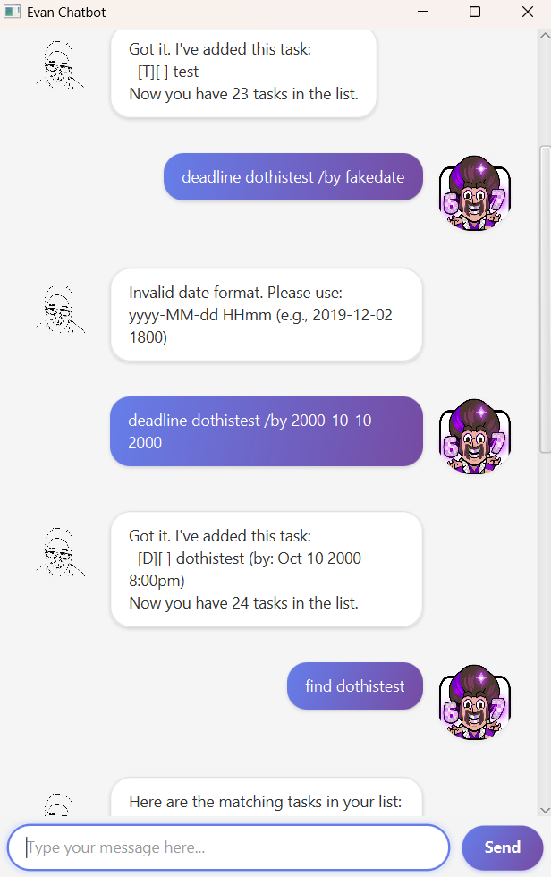

# Evan User Guide

Evan is a **personal task management chatbot** that helps you keep track of your to-dos, deadlines, and events through a simple command-line interface. With Evan, you can easily add, manage, and search through your tasks!



## Quick Start

1. Ensure you have Java 11 or above installed
2. Download the latest version from the releases page
3. Double-click the jar file to start the application
4. Type commands in the input box and press Enter to interact with Evan
5. Refer to the Features below for details on each command

---

## Features

### Adding Tasks

Evan supports three types of tasks:

#### 1. Adding a ToDo: `todo`

Adds a simple task without any date/time.

**Format:** `todo <description>`

**Example:**

```
todo read book
```

**Expected Output:**

```
Got it. I've added this task:
  [T][ ] read book
Now you have 1 tasks in the list.
```

#### 2. Adding a Deadline: `deadline`

Adds a task that needs to be done by a specific date and time.

**Format:** `deadline <description> /by <date time>`

- Date format: `yyyy-MM-dd HHmm` (e.g., 2024-12-25 1800)

**Example:**

```
deadline submit assignment /by 2024-03-15 2359
```

**Expected Output:**

```
Got it. I've added this task:
  [D][ ] submit assignment (by: Mar 15 2024 11:59PM)
Now you have 2 tasks in the list.
```

#### 3. Adding an Event: `event`

Adds a task that happens during a specific time period.

**Format:** `event <description> /from <start time> /to <end time>`

- Date format: `yyyy-MM-dd HHmm` (e.g., 2024-12-25 1400)

**Example:**

```
event project meeting /from 2024-03-20 1400 /to 2024-03-20 1600
```

**Expected Output:**

```
Got it. I've added this task:
  [E][ ] project meeting (from: Mar 20 2024 2:00PM to: Mar 20 2024 4:00PM)
Now you have 3 tasks in the list.
```

---

### Managing Tasks

#### Listing all tasks: `list`

Shows all tasks in your task list.

**Format:** `list`

**Example:**

```
list
```

**Expected Output:**

```
Here are the tasks in your list:
1. [T][ ] read book
2. [D][ ] submit assignment (by: Mar 15 2024 11:59PM)
3. [E][ ] project meeting (from: Mar 20 2024 2:00PM to: Mar 20 2024 4:00PM)
```

#### Marking a task as done: `mark`

Marks a task as completed.

**Format:** `mark <task number>`

**Example:**

```
mark 1
```

**Expected Output:**

```
Nice! I've marked this task as done:
  [T][X] read book
```

#### Unmarking a task: `unmark`

Marks a task as not done.

**Format:** `unmark <task number>`

**Example:**

```
unmark 1
```

**Expected Output:**

```
OK, I've marked this task as not done yet:
  [T][ ] read book
```

#### Deleting a task: `delete`

Removes a task from your task list.

**Format:** `delete <task number>`

**Example:**

```
delete 2
```

**Expected Output:**

```
Noted. I've removed this task:
  [D][ ] submit assignment (by: Mar 15 2024 11:59PM)
Now you have 2 tasks in the list.
```

---

### Finding Tasks

#### Finding tasks by keyword: `find`

Searches for tasks containing the specified keyword.

**Format:** `find <keyword>`

**Example:**

```
find book
```

**Expected Output:**

```
Here are the matching tasks in your list:
1. [T][ ] read book
2. [T][ ] return book
```

---

### Other Features

#### Undoing the last action: `undo`

Reverts the last undoable command (add, delete, mark, unmark).

**Format:** `undo`

**Example:**

```
undo
```

**Expected Output:**

```
Undone!
```

#### Exiting the program: `bye`

Closes the application.

**Format:** `bye`

**Example:**

```
bye
```

**Expected Output:**

```
Don't leave me ):
```

---

## Command Summary

| Command      | Format                                        | Example                                                   |
| ------------ | --------------------------------------------- | --------------------------------------------------------- |
| Add ToDo     | `todo <description>`                          | `todo read book`                                          |
| Add Deadline | `deadline <description> /by <datetime>`       | `deadline submit report /by 2024-03-15 2359`              |
| Add Event    | `event <description> /from <start> /to <end>` | `event meeting /from 2024-03-20 1400 /to 2024-03-20 1600` |
| List         | `list`                                        | `list`                                                    |
| Mark         | `mark <task number>`                          | `mark 1`                                                  |
| Unmark       | `unmark <task number>`                        | `unmark 1`                                                |
| Delete       | `delete <task number>`                        | `delete 2`                                                |
| Find         | `find <keyword>`                              | `find book`                                               |
| Undo         | `undo`                                        | `undo`                                                    |
| Exit         | `bye`                                         | `bye`                                                     |

---

## Notes

- Task numbers in commands refer to the position in the list shown by the `list` command
- Date and time format must be `yyyy-MM-dd HHmm` (e.g., 2024-12-25 1800 for 25 Dec 2024, 6:00 PM)
- All tasks are automatically saved to disk when added, modified, or deleted
- The `undo` command can reverse add, delete, mark, and unmark operations
